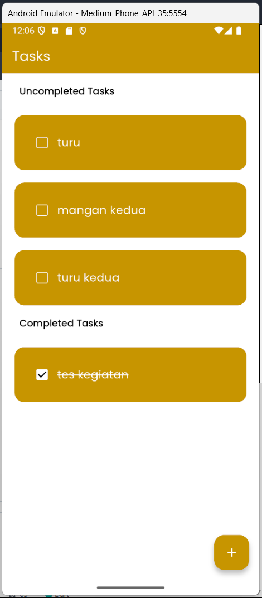

# Tugas 1 PPB C Simple CRUD Flutter App
| Name           | NRP        | Kelas     |
| ---            | ---        | ----------|
| Ivan Fairuz Adinata | 5025221167 | Pemrograman Perangkat Bergerak C |

## Referensi :

- Github : https://github.com/otabekinha/todo_app_flutter.git
- Youtube : https://youtu.be/VfdTUKt21Ls?si=SvJVOSJXKsykVpHs

## Penjelasan Aplikasi

Aplikasi yang saya clone merupakan aplikasi simple todo list. Di dalam aplikasinya, user dapat menambahkan tasks, mencentang tasks, dan menghapus tasks.

## Modifikasi

Saya menambahkan dan memodifikasi beberapa hal, yaitu:
- Fitur Edit. Unuk memenuhi kriteria tugas CRUD, aplikasi yang saya clone belum memiliki unsur Update atau fitur edit. Saya menambahkan fungsi untuk membuat user bisa mengedit task yang sudah dibuat.
- Penyesuaian urutan task. Saya melakukan sortir terhadap Uncompleted Task dan Completed Task. Ketika user menambahkan task baru, task akan otomatis berada pada urutan paling atas. Lalu, apabila user mencentang task yang sudah dikerjakan, maka task tersebut akan berpindah ke bawah, ke section Completed Task.
- Font dan Warna. Saya menambahkan folder fonts di mana saya melakukan import font ttf yang telah saya download sebelumnya. Selain itu, saya mengubah warna pada setiap elemen page dari yang sebelumnya dibuat oleh creator otabekinha.

## Video Demo

Link Youtube : https://youtu.be/1XeQVvB5JlE